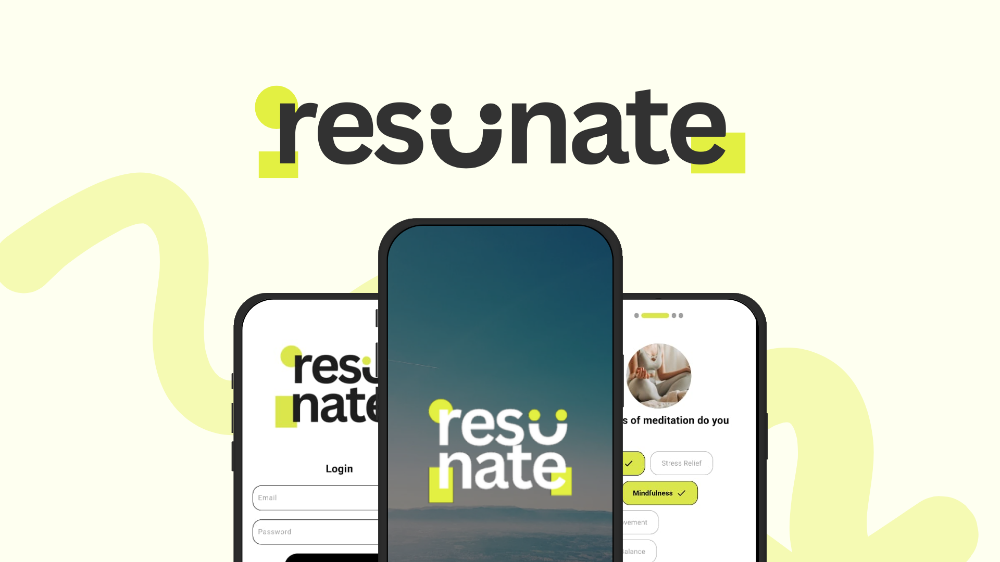

Resunate is an interactive wellness mobile application designed to meet the growing demand for a single platform that integrates mindfulness, fitness, and nutrition. The goal of the app is to bridge the gap between mental well-being and physical fitness in one cohesive app, making wellness more accessible and less overwhelming.

The app simplifies wellness by providing a comprehensive approach to help users stay consistent with their goals. 

## 🎯 Purpose and Target Audience
The Resunate App is designed to offer a wellness solution that brings mindfulness, fitness, and nutrition together in a single platform. It caters to each user's individual needs, aiming to be accessible and inclusive for everyone.

Resunate supports people from all backgrounds who value both their mental and physical health. It adapts to specific user goals and provides a comprehensive approach to wellness, which includes:

- Mindfulness exercises 
- Fitness exercises
- Meal plans and tips

## 💻 Technology Stack

- **Development Framework:** Flutter 
- **Programming Language:** Dart 
- **Database:** Firebase

